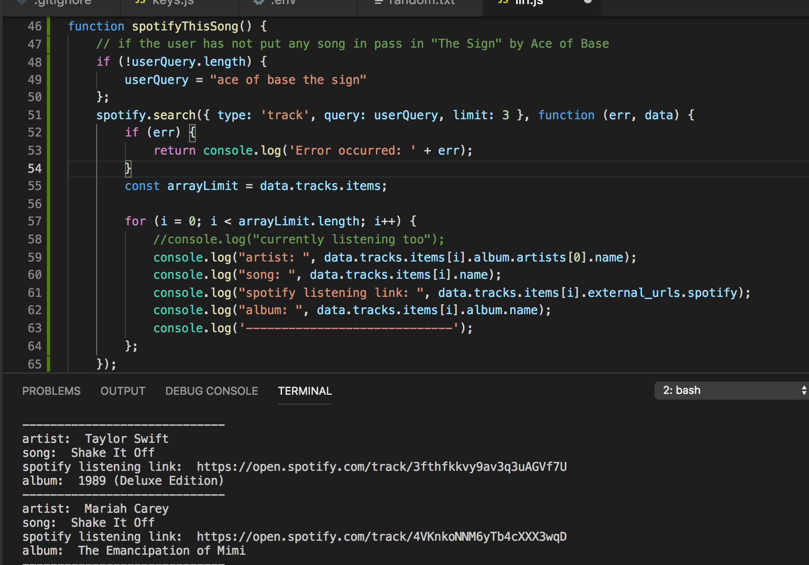
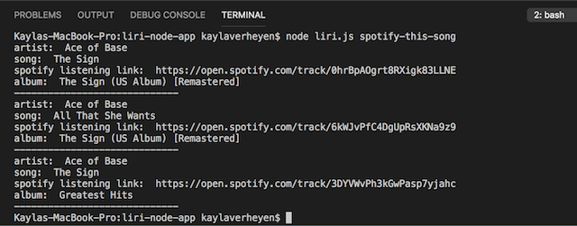
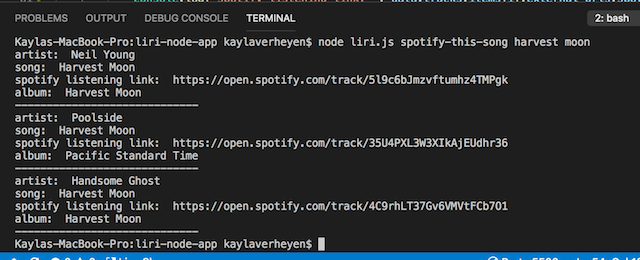
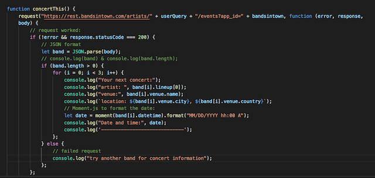
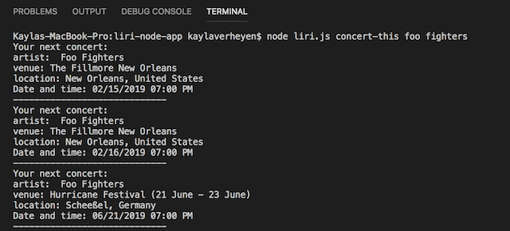
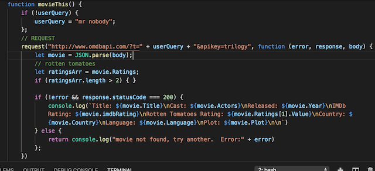
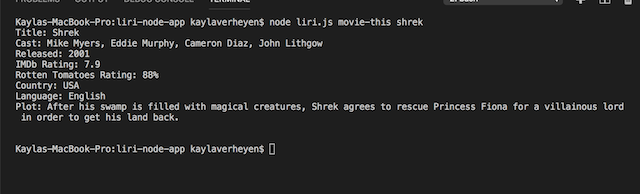
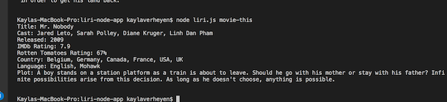
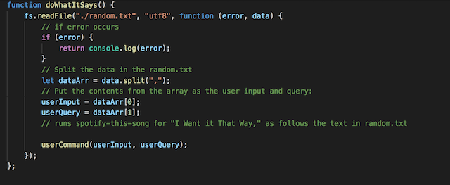
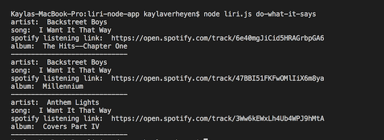

# liri-node-app
App: Liri-Node-App
Created for: Northwestern Coding Bootcamp 
Developer: Kayla Verheyen 
Deployment Date:  November 8th, 2018 
Published: GitHub <https://kaylaverheyen.github.io/liri-node-app/> \
Backend Technologies: Node.js, moment.js, 

## Summary: 
Using these four commands:[with node liri.js] 
**"spotify-this-song"**: user enters a song and the request is sent to spotify API, which then returns spotify data on that song. 
**"movie-this"**: user enters a movie and the request sends information to omdb API to return the movie information.
**"concert-this"**: user enters a band or artist. The request is sent to bands in town API, which then returns the response of their next concert and it's location and date.

**"do-what-it-says"**: user just enters the prompt, which then uses the data from the random.txt file, and returns spotify information on that song. 

### spotify-this-song screen grabs

* no request made

* entered the song "harvest moon"

 

### Concert-this screen grabs

* entered the band: Foo fighters

 

### Movie-this screen grabs

* looked up shrek

* no movie entered: Mr nobody

 

### Do-What-it-Says screen grabs

* it's grabbing text from the file and requesting data from spotify-this api, to return data about that song. 

 

## Notes:

